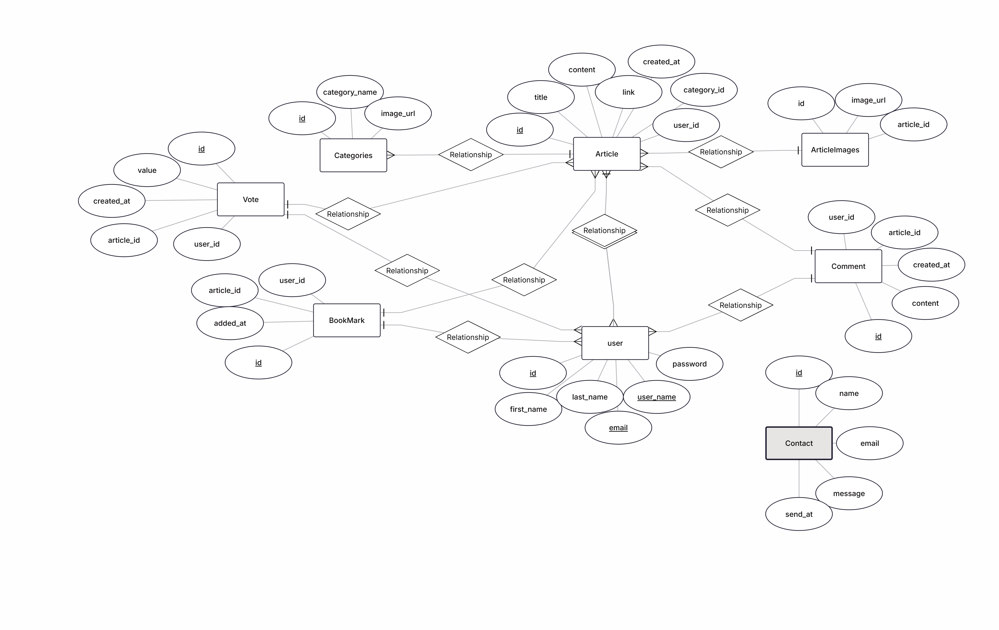

# 🧠 ThinkShare

**ThinkShare** is a Django-based content-sharing web application developed as a **Capstone Project**.

---

## 📖 Project Overview

**ThinkShare** is a modern content platform where users can explore trending and newly published articles across various categories.  
Visitors can read engaging posts, access detailed information about each article, and interact with content through a clean, intuitive interface.

---

## 🚀 Key Features

- **Trending Articles Slider**  
  Highlights the most popular articles with images and brief descriptions. Users can navigate using next/previous buttons, and the slider automatically transitions every 5 seconds for a smooth browsing experience.

- **Newest Articles Section**  
  Displays the latest articles in a responsive card-based layout, including the title, short excerpt, author name, creation date, and featured image.

- **Sorting and Filtering**  
  Allows users to sort articles by criteria such as *most votes* or *newest first*, and filter by category or author for a personalized experience.

- **User Interaction**  
  Registered users can view full article details, comment, vote, and bookmark posts.  
  Certain sections—like signup prompts—are conditionally displayed depending on authentication status.

- **Markdown-Based Article Creation**  
  Authors can create and format article content using **Markdown**, enabling easy styling of text with headings, lists, links, images, and code blocks.  
  This ensures a consistent and visually structured reading experience.

- **Responsive Design**  
  Fully responsive layout optimized for desktops, tablets, and mobile devices.  
  The design adapts smoothly to different screen sizes without sacrificing usability.

- **Clean and Modern UI**  
  Aesthetically designed with subtle shadows, hover effects, rounded corners, and minimalistic card layouts.

---

## 🧩 Tech Stack

| Layer | Technology |
|--------|-------------|
| **Backend** | Django |
| **Frontend** | HTML, CSS, JavaScript |
| **Database** | PostgreSQL |

---

## 🧮 Entity-Relationship Diagram (ERD)



---

## 🗂️ Models Summary

### **Categories**
| Field | Type |
|--------|------|
| `category_name` | CharField |
| `image_url` | ImageField |

### **Article**
| Field | Type |
|--------|------|
| `title` | CharField |
| `content` | TextField |
| `link` | CharField (optional) |
| `created_at` | DateTimeField |
| `user` | ForeignKey → User |
| `category` | ForeignKey → Categories |
| **Relations** | `ArticleImages`, `Comment` |

### **ArticleImages**
| Field | Type |
|--------|------|
| `image_url` | ImageField |
| `article` | ForeignKey → Article |

### **Comment**
| Field | Type |
|--------|------|
| `content` | TextField |
| `created_at` | DateTimeField |
| `article` | ForeignKey → Article |
| `user` | ForeignKey → User |

### **Vote**
| Field | Type |
|--------|------|
| `value` | IntegerField |
| `created_at` | DateTimeField |
| `article` | ForeignKey → Article |
| `user` | ForeignKey → User |

### **Bookmark**
| Field | Type |
|--------|------|
| `user` | ForeignKey → User |
| `article` | ForeignKey → Article |
| `added_at` | DateTimeField |

### **Contact**
| Field | Type |
|--------|------|
| `name` | CharField |
| `email` | EmailField |
| `message` | TextField |
| `send_at` | DateTimeField |

---

## 👥 User Stories

### **Actors:**  
Guest, Registered User, Admin

#### **Guest**
- Can browse and read articles.  
- Can view article details (read-only).  
- Can send messages via the contact form.

#### **Registered User**
- Can sign up, sign in, and sign out.  
- Can create an article with title, content (Markdown), optional link, category, and multiple images.  
- Can edit or delete their own articles.  
- Can comment on articles.  
- Can like or dislike an article (one vote per article).  
- Can bookmark articles for later reading.  
- Can view their profile with a list of authored articles and bookmarks.  
- Can update profile information and change password.

#### **Admin**
- Can manage users, categories, and moderate content via the Django admin panel.

---

## 💡 Future Enhancements

- Implement user notifications for comments and likes.  
- Add article search functionality with keyword highlighting. 
- Add category preview and article display — allow users to view all available categories and browse articles belonging to each category. 
- Enable dark mode for better accessibility.

---

## 🧰 Installation & Setup

```bash
# 1️⃣ Clone the repository
# 1️⃣ Clone the repository
git clone <repository-link>

# 2️⃣ Navigate to the project directory
cd thinkshare

# 3️⃣ Create and activate a virtual environment
python -m venv venv

# Activate the virtual environment
# On macOS/Linux:
source venv/bin/activate
# On Windows:
venv\Scripts\activate

# 4️⃣ Install dependencies
pip install -r requirements.txt

# (Optional) If requirements.txt doesn’t include these, install manually:
pip install psycopg2-binary Pillow markdown

# 5️⃣ Apply migrations
python manage.py makemigrations
python manage.py migrate

# 6️⃣ Create a superuser (for Django Admin access)
python manage.py createsuperuser

# 7️⃣ Run the development server
python manage.py runserver
